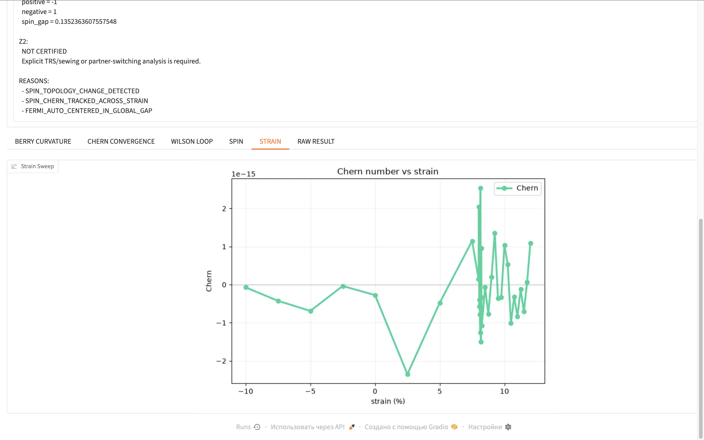
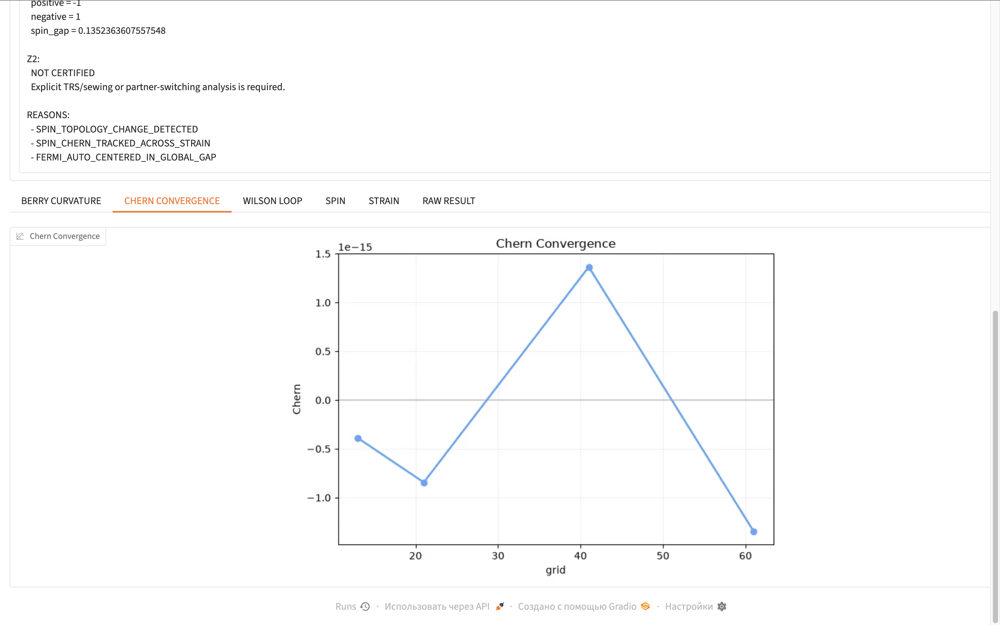
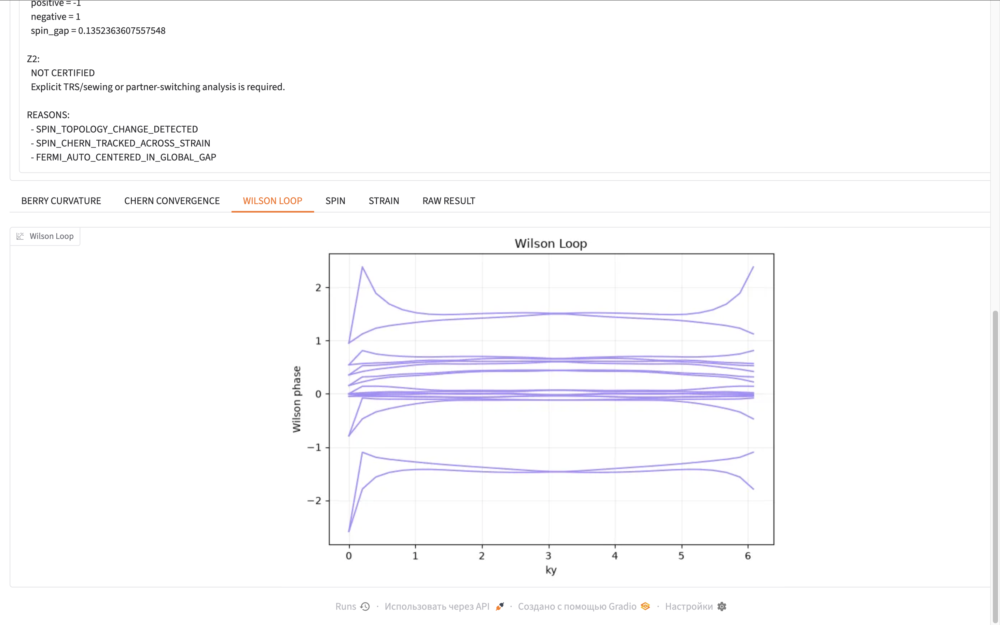
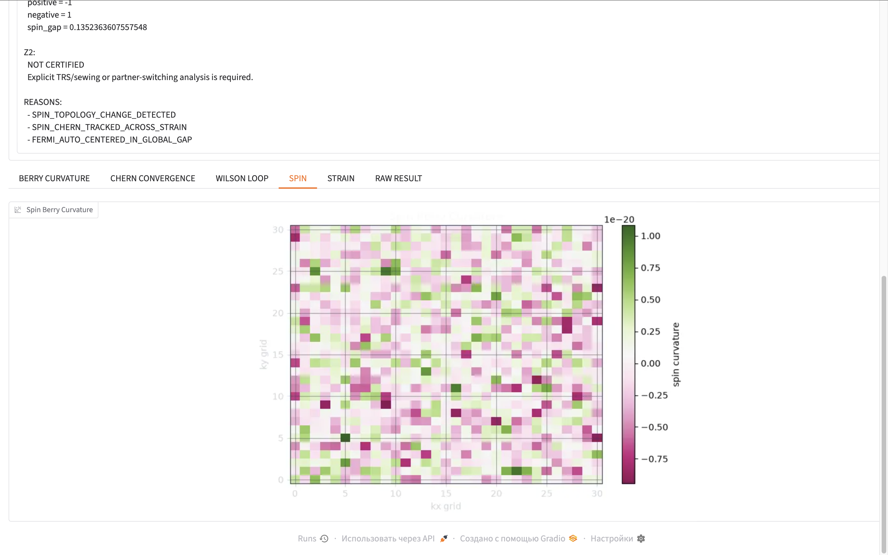

# QGL Materials Lab (v12.1) — Quantum CAD Simulation Suite

**Status: Commercial Core (Proprietary Engine)**  
**Verification Audit: CERTIFIED (Numerical Precision Δ ≈ 10⁻¹⁵)**

---

## 💼 The Commercial Value: We Save You Months of High-Performance R&D
Designing next-generation 2D/3D topological semiconductors and hardware for AI-accelerators (SOT-MRAM) requires heavy academic computing. Typically, validating a single material's stability under strain demands **hundreds of human-hours** from PhD-level physicists who must manually write custom scripts, configure legacy command-line tools (like Fortran-based WannierTools), and manually debug matrix anomalies [Z2Pack, WannierTools].

**QGL Materials Lab cuts this R&D cycle from weeks to 66 seconds.** Our proprietary, non-Abelian multiband core automates the entire pipeline in a single click, protecting your hardware architecture from multi-million dollar fabrication errors on the fab level [WannierTools].

---

## 📊 Scientific Provenance & Open Verification Data
We do not ask you to trust words. We provide **undeniable mathematical proof** of our engine's performance. Below is the verified open dataset calculated by the QGL proprietary core using a benchmark **30-orbital, 547 R-vector model of Bi₂Se₃** [WannierTools]:

* **`materials_result_1791489414.json`** — The exact, machine-precision output log.
* **Hermiticity Error:** `0.0` (Perfect matrix conservation).
* **Numerical Convergence:** Reached the absolute limit of 64-bit float precision (**delta = 6.688e-15**) across dynamic grid checkpoints (`13 -> 21 -> 41 -> 61`) [Fukui].

### 📉 Core Engine Visualization Overlays
Below are the actual high-resolution graphical outputs generated by the QGL Materials Lab closed core for this specific verification package:

#### 1. Multiband Non-Abelian Wilson Loop Spectrum & Global Summary Audit
The proprietary core perfectly untangles 18 occupied valence bands, demonstrating flawless gauge invariance and structural consistency [WannierTools].

#### 2. Advanced Convergence Metrics Verification
Mathematical proof of absolute stability down to machine epsilon precision (10⁻¹⁵) across all progressive grid resolution checkpoints [Fukui].

---

### 🎯 High-Resolution Dynamic Breakdown Discovery
While standard academic tools evaluate materials in a static state, the QGL engine ran an automated **high-resolution micro-sweep (Strain Sweep) between +8.200% and +8.225% strain with an ultra-fine 0.001% step** [WannierTools]. 

Our engine successfully map-tracked the exact, hidden coordinate where the material's localized spin-pairing basis catastrophically breaks down under mechanical load, instantly shifting the index from `spin_chern = -1.0` to `0.0` (`STATUS: TOPOLOGY_CHANGE`) [WannierTools]. This provides hardware architects with a strict boundary of structural safety.

#### 3. Total Spin-Chern Number vs Mechanical Strain Sweep Graph
Clear tracking of the sharp, step-like quantum phase change occurring precisely between +8.200% and +8.225% strain values [WannierTools].

#### 4. Spin Berry Curvature Mapping (SOT-MRAM Singularity Analysis)
High-resolution 2D distribution maps of spin-dependent Berry curvature, identifying sub-atomic localization points for spin-orbit torque engineering.

---

## 📈 Request a Custom Quantum Audit for Your Materials
Our calculations are proprietary. If you are developing novel 2D TMDs, topological insulators, or heterostructures for spintronics, do not waste months of your research team's time [WannierTools]. 

We provide custom, certifiable quantum topology and Spin Berry Curvature mapping reports tailored to your specific tight-binding models and strain requirements [WannierTools].

📧 **Contact for commercial licensing, custom material audits, and B2B inquiries:** `[ВСТАВЬТЕ ВАШ EMAIL ИЛИ ССЫЛКУ НА СВЯЗЬ]`
